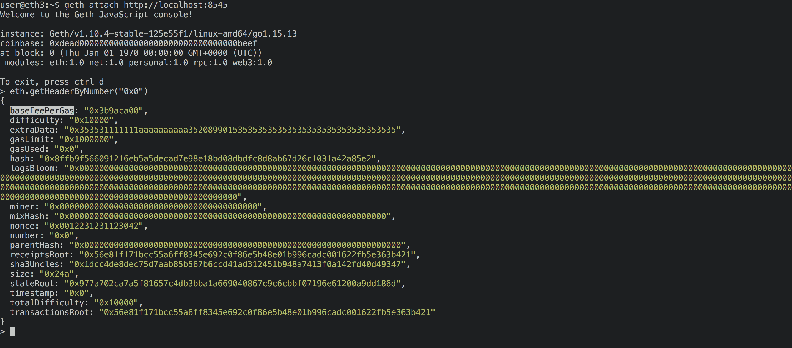
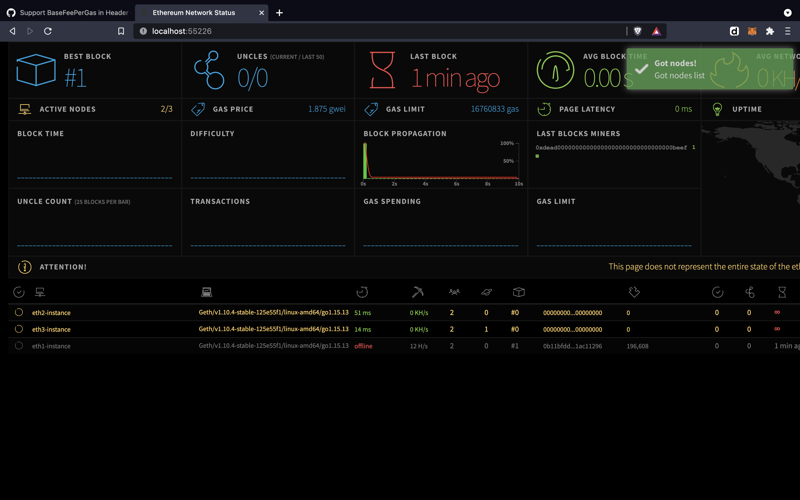

### Notes: 

* Setup: 

    * 3 mev-geth nodes (`jason/v1.11-mev` branch) and 1 bootnode (to allow peering) on a shared docker network

    * The 3 nodes are mining, with 8 threads, and propagate txs/blocks upon mining as expected (though DAG generation can take a long time)

    * `--override.london=0` to force the london hardfork from genesis block

        * Confimed by making sure `baseFeePerGas` is exposed in the block header

        

    * All  nodes have their RPCs (port :8545) enabled + binded to :1111, :1112, :1113, :1114 ports on the host machine (to send txs to them)

    * Also a network dashboard to help debug (making sure blocks are mined, peers are alive), can be visited by opening the random port (assigned by docker after running) in the browser

      


* Running 

    * First, build the required docker images

        * `./build.sh`

    * Next, deploy + start the containers

        * `./run deploy`
    
    * To stop/start after: 
        * `./run stop` and `./run start`

    * send sample tx (to a random peer RPC): 
        * `npm run sendTx`


```
run deploy
run start
run stop
run login nodename
run geth nodename
run log nodeName

^nodeName = ethbn/eth1/eth2/eth3
```
Next steps: 

* Migrating to ethers, relevant https://github.com/ethers-io/ethers.js/issues/1685

* Adjust gaslimit in the genesis.json file to test for the following conditions: 

   * `Each block’s baseFeePerGas can increase/decrease by up to 12.5% depending on how full the block is relative to the previous one: e.g. 100% full -> +12.5%, 50% full -> same, 0% full -> -12.5%.`
 
   * Making sure bundles don't break this^
 
* Migrating old bundle flow rate script here to stress test the basefee + how tip must be adjusted to get included
